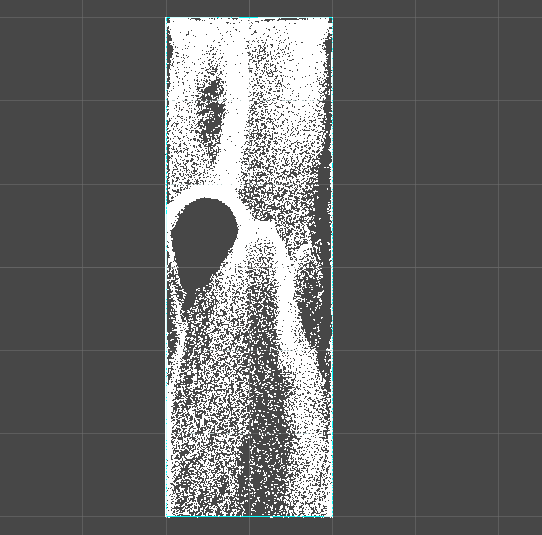
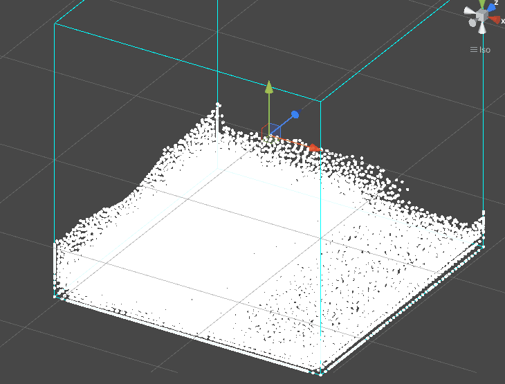
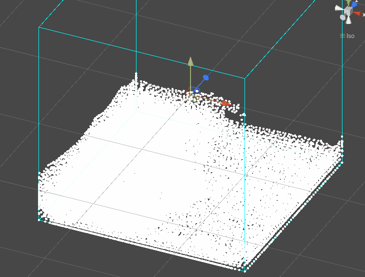

# UnitySPHFluid

Follows the [Tutorial](https://interactivecomputergraphics.github.io/SPH-Tutorial/) to implement 3D SPH in Unity. 

**It is still under development.**

- [x] State Equation Pressure Term
- [x] Cubic spline kernel
- [x] Uniform Space Grid Hashing/Sorting
- [x] Vorticity Confinement Term
- [x]  13K/26K Particles in real time
- [ ] SDF/Obstacle Particles for boundary
- [ ] Poisson solver for pressure term
- [ ] Surface tension term
- [ ] Solid/Fluid Coupling

